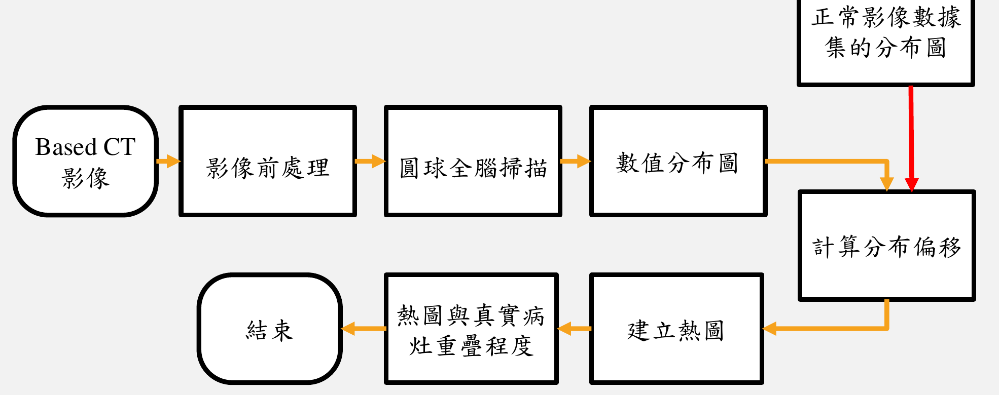
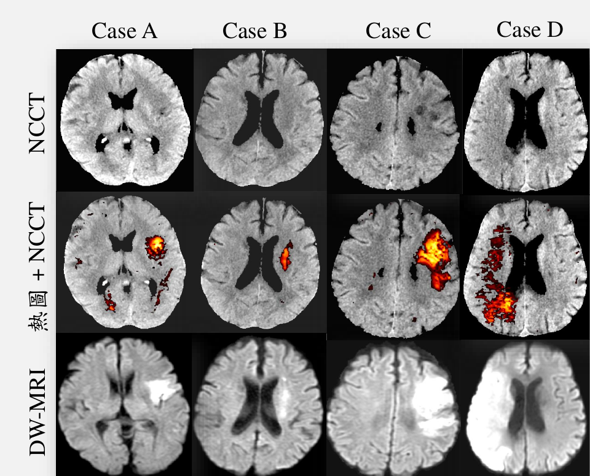

# 以數值分佈為基礎的缺血性中風電腦斷層影像分析

**Numerical Distribution Analysis of Ischemic Stroke on Computed Tomography Images**

本專案提出一套以數值分析為基礎的方法，透過非顯影電腦斷層 (NCCT) 影像，找出
缺血性中風的病灶位置。整體流程從原始 DICOM 影像開始，經過前處理、腦室編號圖譜
建立，再以「圓球全腦掃描」逐點統計 CT 數值分布，並與健康資料集比較計算分布
偏移量，最終產生標示可疑病灶的熱圖 (heatmap)，可作為輔助臨床判讀的參考工具。

> 研究生：王奕傑｜指導老師：羅畯義 博士｜中原大學碩士論文口試（2025/7/3）

---

## 研究流程

整體流程分為三大階段，各階段的詳細作法、參數與使用方式請參考對應的 README：

| 階段 | 說明 |
|---|---|
| 1. 影像前處理 | DICOM 轉 NIfTI → 顱骨去除 → 腦室分割 |
| 2. 腦編號圖譜建立 | ANTs 配準，將標準空間編號圖譜對位到個體 CT 空間 |
| 3. 圓球全腦掃描與熱圖 | 逐編號取球型區域，與健康資料集比較計算分布偏移，建立熱圖 |

---

## 結果

熱圖標示的可疑病灶位置，與作為黃金標準的 DW-MRI 病灶位置相似：

（NCCT：原始影像；熱圖 + NCCT：本方法標示結果；DW-MRI：對應病灶黃金標準）

更多案例、不同切片與不同球型半徑的比較結果，請參考論文簡報。

---

## 資料集

- **影像來源**：新北市雙和醫院
- **NCCT 影像**：共 276 例（正常腦影像 188 例、缺血性中風腦影像 88 例，
  中風影像皆有對應的 DW-MRI）
- **CT 影像規格**：512 × 512 × 32 體素，體素大小 0.5 × 0.5 × 5 mm³，
  GE Revolution EVO，120 kVp，250 mA

健康資料集直方圖與左右對稱 mapping 等輔助檔案說明，詳見熱圖分析的 README。

---

## 限制與未來發展

目前方法依賴左右半球對稱性偵測異常，對雙側對稱中風、舊中風或腦白質疏鬆症
影像較不適用；DW-MRI 作為黃金標準也存在拍攝時間差導致病灶體積不完全一致的
限制。未來可結合深度學習分割技術與機器學習方法，強化偵測效能並加速流程。

詳細討論請參考論文簡報中「問題與討論」章節。

---

## 參考文獻

- M. A. Almekhlafi et al., *Stroke*, 2021
- Chiang, et al., *Journal of Clinical Medicine*, 2022
- Tang et al., *Computers in Biology and Medicine*, 2011
- Srivatsan et al., *Journal of Neuroimaging*, 2019
- Mokin et al., *Stroke*, 2017
- John Muschelli et al., *NeuroImage*, 2015
- Cauley et al., *Journal of Computer Assisted Tomography*, 2017
- Arboix et al., *Expert Review of Neurotherapeutics*, 2009
- Nordström et al., *Computer Vision and Pattern Recognition Conference*, 2025
